| [Session 2 →](../session_2/README.md) |
|---------------------------------------|

## Ruby Course Session 1

Session Content:
- [Intro][1]
- [History][2]
- [Setting up environment][3]
- [The Command Line][4]
- [The IDE][5]
- [Exercises][6]

Welcome to the world of Ruby!
-----------------------------

You might have heard quite a bit about the language or the ever-so-famous [Ruby on Rails][7] framework that was built with Ruby.

In this session, we will be setting up your development environment in order to get started with programming in Ruby.

If you are familiar with HTML, CSS or even JavaScript, you might not have done steps that we will do. The reason is that we have to install Ruby on our machine in order to be able to program with it.

For simplicity and reliability, we will be using a Virtual Machine that has Ruby installed on it. This is because people on this course will be using different operating systems and that will probably cause us some delays in setting up each environment. However, if you would like to set up Ruby locally on your machine, please feel free to approach me and I'll point you in the right direction.

Ruby History
------------

I guess it is the right time to ask what is Ruby :P

Well, to simplify it for people who will be coding for the first time, Ruby is a server side language. This means that in the case of web development, the Ruby code that you write, will be living in the server and not on the client side. For those of you that are a bit more advanced, Ruby is a object-oriented, general-purpose programming language.

The more you deal with Ruby, the more you will understand and realise how elegant and well built the language is.

The following quote is from the creator of the Ruby language, Yukihiro "Matz" Matsumoto:

> I was talking with my colleague about the possibility of an object-oriented scripting language. I knew Perl (Perl4, not Perl5), but I didn't like it really, because it had the smell of a toy language (it still has). The object-oriented language seemed very promising. I knew Python then. But I didn't like it, because I didn't think it was a true object-oriented language — OO features appeared to be add-on to the language. As a language maniac and OO fan for 15 years, I really wanted a genuine object-oriented, easy-to-use scripting language. I looked for but couldn't find one. So I decided to make it

Another interesting point that should be noted, Ruby was designed for programmer productivity and fun. Matz explained his philosophy like so:

> I hope to see Ruby help every programmer in the world to be productive, and to enjoy programming, and to be happy. That is the primary purpose of Ruby language.

And for you eager ones that are wondering, Ruby was written in the C language.

Let's get started!
------------------

1. Install/Use Google Chrome as the default web browser for this course (Consistency)
2. Create an account on [Github][8] (I'll explain why later)
2. Sign up for an account on [Koding][9] **with your Github account**
3. While we wait, we'll talk a bit about why we're using Koding and why a `*nix` based Operating system
4. When the registration is done, Turn on the Virtual Machine.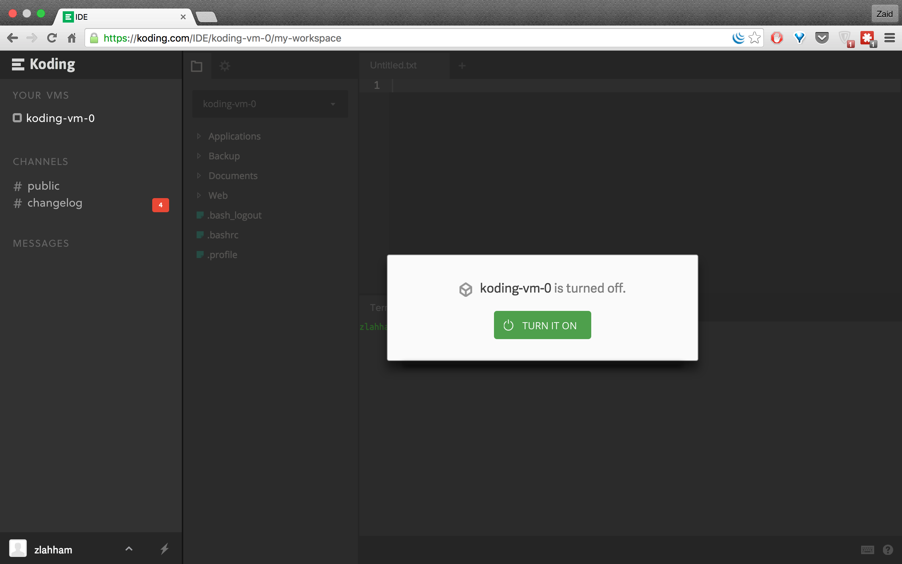
5. You should arrive to a screen similar to this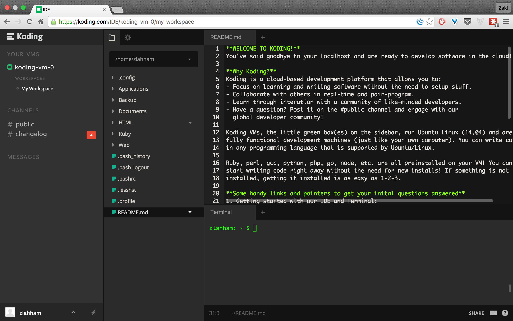

6. Now we want to check if Ruby is installed on the VM so we will type `ruby -v` into the open terminal tab.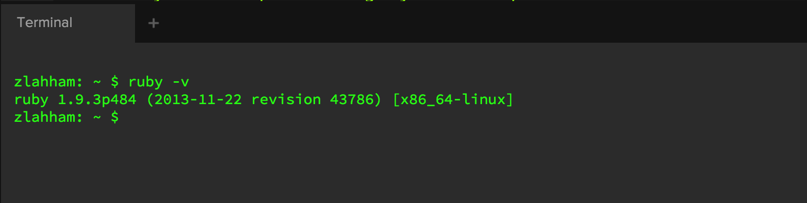

7. We want to use a newer version than 1.9. to do that, we will need to install it using the built in Koding Package Manager. On the same terminal window, type in `kpm install ruby2` and wait for a few seconds.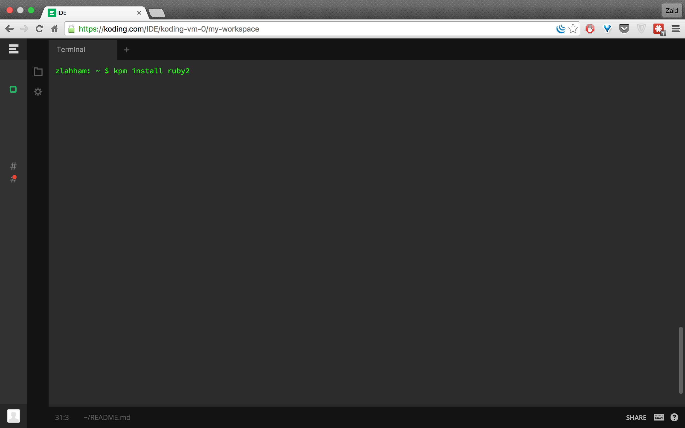
8. After the installer has finished, type in `ruby -v` again and this time you should read `ruby 2.0.0`, Great!!
9. Now we are ready to get started with the command line.

The Command Line
----------------
The command line is an interface for typing commands directly to a computer's operating system. Every single operating system has some way of accessing the command line. Up until the Graphical User Interface (GUI) was officially introduced in 1973, the only way to use a computer was through the Command Line Interpreter (CLI).

We will be learning how to use a Unix based command line shell called Bash for this course. You can read more on the different types of command lines interpreters [here][4]

So far we have already used the command line in the previous steps. In the Koding IDE (Integrated Development Environment), the command line is inside the "Terminal" tab. If you do not have an open Terminal session already, you can find it here:
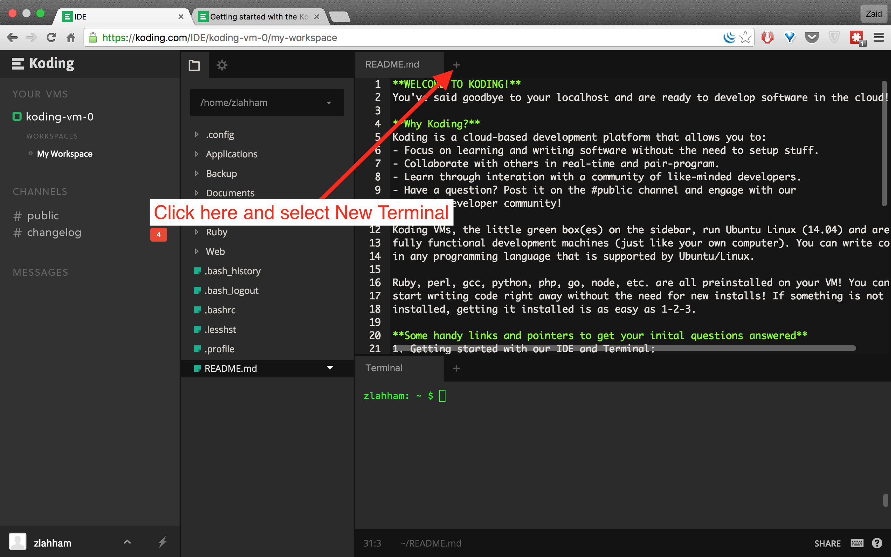

For the following exercises, please type in all the examples in order to understand what is going on.

####Listing files
The most basic command is `ls` which lists all the files in the current directory/folder.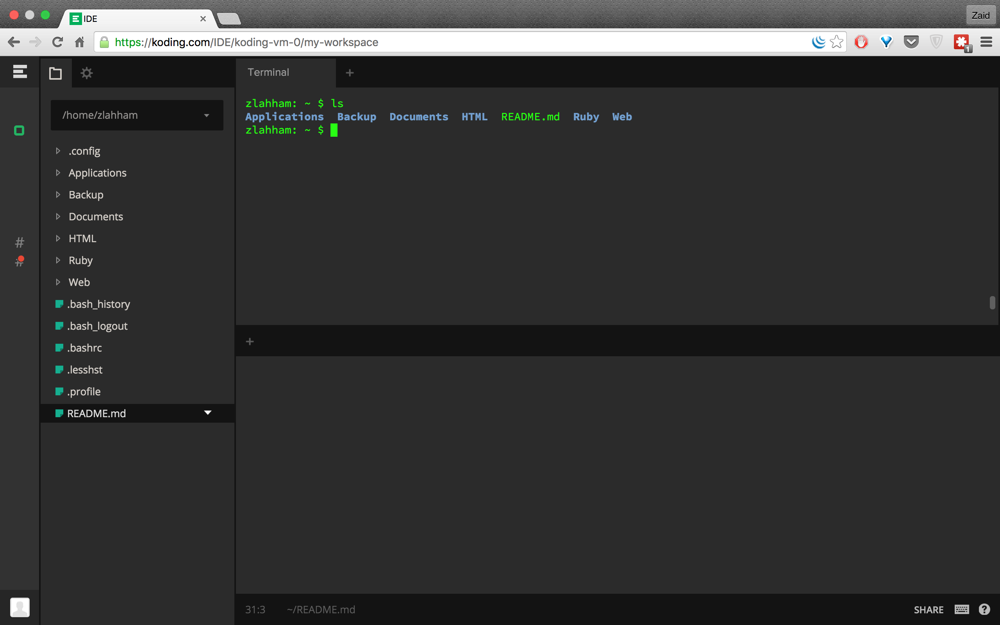
If you take a closer look at the file system on the left hand side, you will notice that the `ls` command actually listed everything on there, except the files/folders that begin with a dot.
If we want to see all the files/folders, include the ones that begin with a dot, we can use `ls -lA` 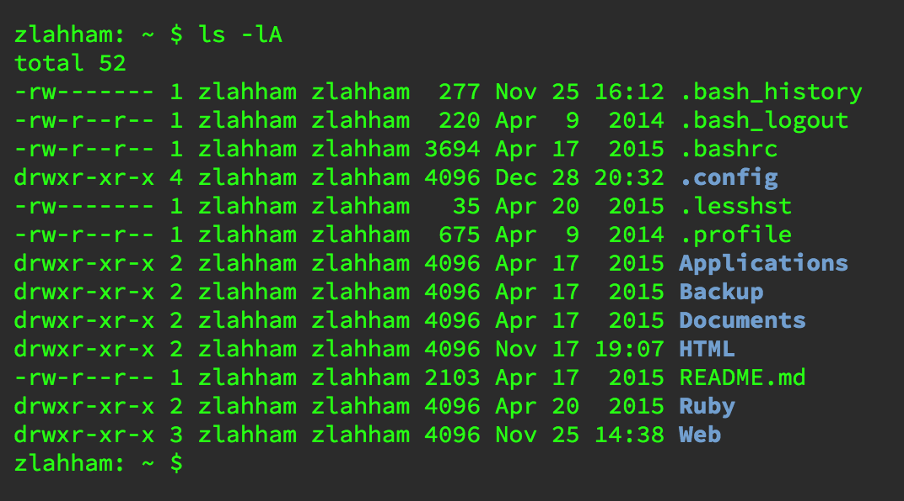

####Current directory
If we want to make sure that we are in the correct directory, we would use the print working directory command, `pwd`.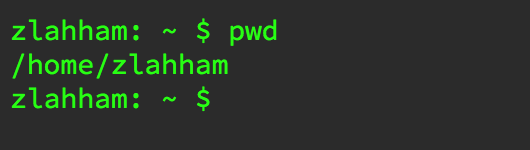

The output shows us exactly where we are starting from the root directory on the computer. To understand how the paths work, you could compare them to creating a folder on your Desktop called work and inside work you create a word document called november-statements. The path for this word document will look like this: `~/Desktop/work/november-statements.docx`.

The tilde `~` means this is the Home directory for the computer.

####Changing directories
What if I wanted to move into another directory other than `/home/zlahham`. This is where the `cd` command comes into play.

If I want to go into the Web folder that was already there when I started the VM, I would type `cd Web` and in order to see what's inside that directory, I would type in `ls`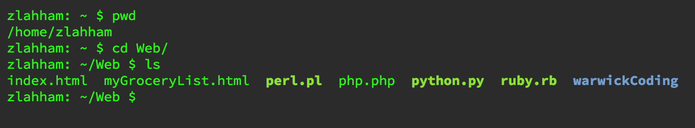

But hey, what if this is not the directory that I'm looking for, how do I go back up to the previous one?
The command would also involve using `cd` but this this we are adding a new parameter `cd ..` The two dots here imply that we want to move up a directory or in other words, go to the parent directory.

####Creating files
It's probably a great time now to make sure that we are clear on the difference between a file and a folder/directory. Files can range from word documents to images, while folders/directories are the actual structures that hold these files in place. It is similar to the actual physical folders that hold paper files inside them.

In this case we want to create an empty file with no extension, we would type in `touch my_first_file`. Touch creates the file into the given directory. We can check that the file was created by typing in `ls` to see if the new file is there 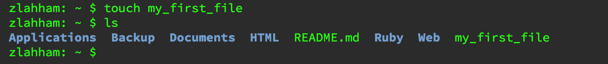

####Creating folders/directories
Now we want to create a folder that will enclose all of our files for the rest of the course. To do so, we have to make sure that we are inside the right directory first of all, by `pwd`, then we type in `mkdir projects`.
mkdir stands for make directory, and we can check this new directory with `ls` 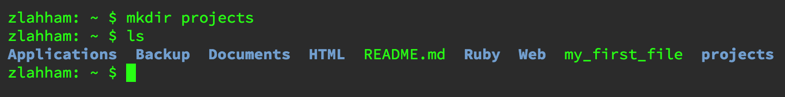

Perfect!

####Removing empty folders/directories
I just realised that I made a mistake in naming the folder. In order to remove it, we'll type `rmdir projects`, which will now delete the aforementioned folder.

####Removing files
Remember that files we created called `my_first_file`? Well I really don't like it, let's get rid of it :P
`rm my_first_file` should do the trick.

Notice the difference between removing files and directories?

####Removing non-empty folders/directories
Okay, lets do the following:
- `mkdir projects2`
- `cd projects2`
- `touch my_second_file`
- `cd ..`

So now we have created a directory, moved into it, created a new file and then finally moved back up to the parent directory.

Lets try to remove this whole directory with the command we learned earlier `rmdir projects2`....

NOPE! our first error: `Directory is not empty`
In this case we have to add a new option to the mix and use `rm` instead of `rmdir`

`rm -r projects2`
The -r means that it should delete all files and folders inside the projects2 as well as itself.

**Further work/reading:**
- IMPORTANT! [Code Academy Course on the Command Line][11]
- [Funny command line tricks][12]

The IDE
-------
By now we have been introduced to the command line. It's high time to take a look at what an IDE is and understand the components that make it whole.
An IDE is an Integrated Development Environment. What that means is that it is a program that has three main parts:
- A terminal (green rectangle)
- A text editor (red rectangle)
- A file system (yellow rectangle)

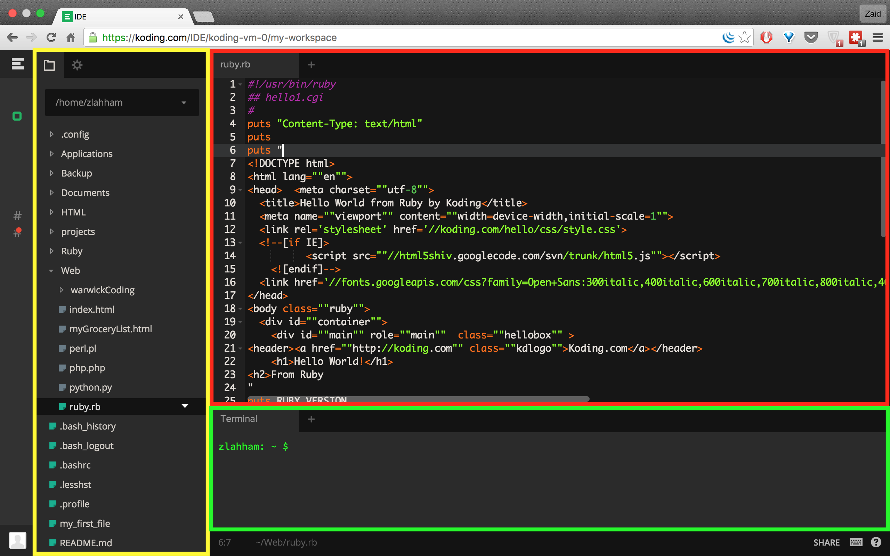

We need the terminal to run the ruby programs that we are going to be writing. We need the text editor to write the ruby code. Finally, we need the file systems to keep everything in one place and be able to understand the navigation visually.

You might have used or heard of other text editors such as Sublime Text, Atom or vim. The reason we will avoid them for this course is to keep everyone on the same development environment.

Exercises
---------

We will attempt a few basic exercises in order to utilise the command line and be able to use it properly for the rest of the course.

####Exercise 1
Using the terminal that is on Koding.com, Create a directory called `warwickCoding` at the same level where you can find other directories such as `Web`.

Inside the newly created warwickCoding directory, create a new directory called `ruby_course`

####Exercise 2
Inside the `ruby_course` directory create a directory named `session_1`

Inside `session_1`, create a file and name it `test.txt`

####Exercise 3
Delete the file `test.txt`

####Exercise 4
Try to find how to rename a file or directory on a bash shell.

  [1]: https://github.com/warwickcoding/ruby/tree/master/session_1#welcome-to-the-world-of-ruby
  [2]: https://github.com/warwickcoding/ruby/tree/master/session_1#ruby-history
  [3]: https://github.com/warwickcoding/ruby/tree/master/session_1#lets-get-started
  [4]: https://github.com/warwickcoding/ruby/tree/master/session_1#the-command-line
  [5]: https://github.com/warwickcoding/ruby/tree/master/session_1#the-ide
  [6]: https://github.com/warwickcoding/ruby/tree/master/session_1#exercises
  [7]: https://en.wikipedia.org/wiki/Ruby_on_Rails
  [8]: www.github.com
  [9]: www.koding.com
  [10]: https://en.wikipedia.org/wiki/Command-line_interface#Operating_system_command-line_interfaces
  [11]: https://www.codecademy.com/learn/learn-the-command-line
  [12]: http://www.tecmint.com/20-funny-commands-of-linux-or-linux-is-fun-in-terminal/
