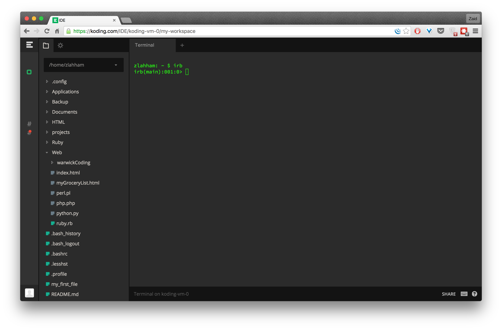
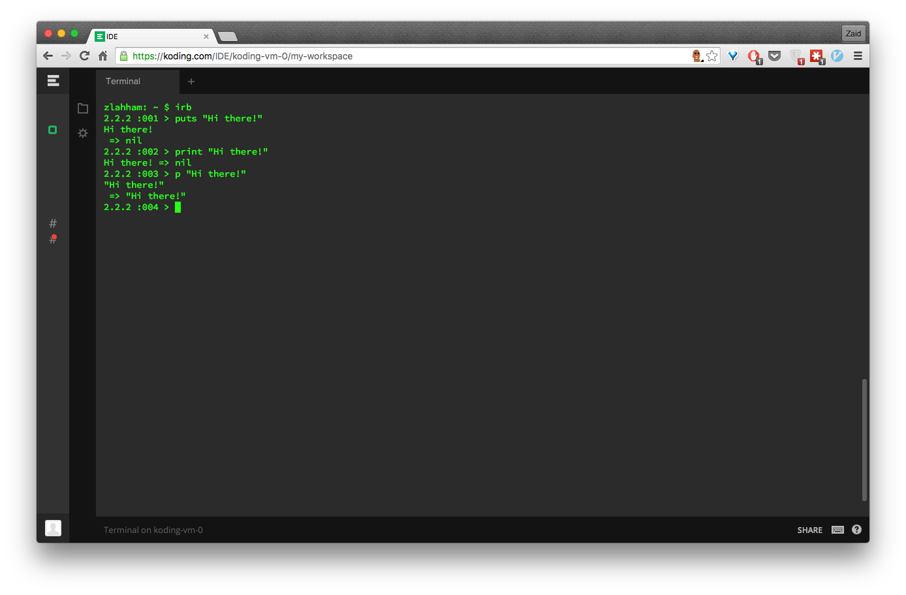
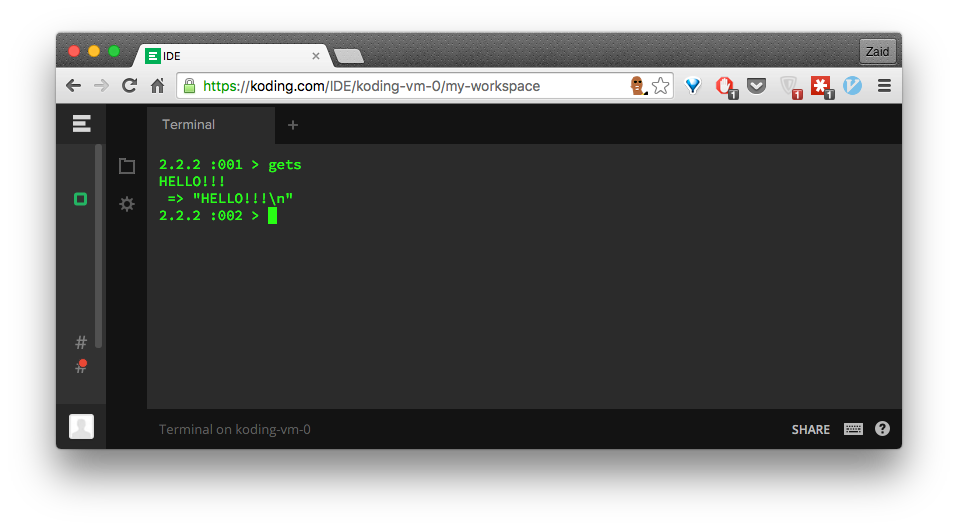

##Ruby Course Session 2

Session Outline:
- [Recap][2]
- [The 3 Rubies][3]
- [Interactive Ruby Shell (irb)][4]
- [Object everything][5]
- [Variables] [6]
- [Data Types][7]
- [Intro to the syntax][8]
- [Ruby Style][9]
- [Exercises][10]

Recap of Session 1
------------------
In the last session we got introduced to the command line and we learned how to use the most commonly used commands such as `ls` `pwd` `cd` etc...

The reason why we learned how to operate the command line first before diving into Ruby is because it would make more sense to do everything through the command line and not through Finder or File Explorer as a programmer.

This is all good practice for later on if you want to keep coding.


Ruby, `ruby` and RUBY
---------------------
You will come across three variations of the same word, and it's important to know the difference especially when you are reading about a certain issue online.

Ruby is the language.

`ruby` is a computer program that you will be using to run your ruby code.

RUBY on the other had does not exist! Some people make the mistake of thinking that Ruby is an acronym for something else. The mixup is because the relate it to other acronym named languages such as BASIC (Beginner's All-purpose Symbolic Instruction Code).


Interactive Ruby Shell (irb)
----------------------------
This is one of the libraries that come built in with the Ruby language. The program is launched from a command line and allows the execution of Ruby commands with immediate response, experimenting in real-time. We can try to launch this from our Koding IDE.

Let's go to www.koding.com and sign in with our Github account that we created last time.

As soon as you're through, you will be asked to Turn on your "koding-vm-0". Wait for it to turn on and then let's open a new Terminal session and then type in `irb`.



You should then get a prompt that starts with `irb(main):001:0>`

Let's quickly type in our first line of Ruby:
```ruby
puts "Hello, world!"
```

This should return the same sentence:

Objects in Ruby
---------------
Ruby sorts related data, and the ways of manipulating it, into an abstract idea called an object.

For example, the data that defines a number, and the methods on that number, define that number object.

At the binary machine level, the data for the number 5 are just ones and zeros, probably looking like this: `00000000000000000000000000000101`.

and since five is an object, it also has methods on it
```ruby
5.even? # => false
5.odd?  # => true
5.next  # => 6
```

Variables
---------
The data for any object exists in a part of the computer memory called the "heap".

When we're storing something with Ruby, it checks for available memory and then stores the object data in the heap.

However, this might become a bit problematic if we cannot track all these different objects. We need to track their address and to do so, we would use a `variable`.

Variables point towards the memory address, so we can access objects through variables.

Variables can be assigned like so:
```ruby
age = 45
```
And then we can check if it is pointing to the right object i.e 45
```ruby
age         # => 45
age.odd?    # => true
```


Data types in Ruby
------------------
In Ruby, there are a number of different data types. 
A data type is a set of values, and the allowable operations on those values. These data types are very important building blocks to the language. They are used to distinguish between the different uses that you might need your program to perform. For example, when dealing with a function in a spreadsheet, you will not be able to mix letters where you are supposed to use numbers, and for that purpose you have to find the appropriate data type to solve the issue. We will clarify this in greater depth later on.

The following list includes the important data types that you will come across in this course:

- Numbers
    - FixNum (Integers)
    - Float
- String
- Symbol
- Array
- Hash
- Booleans

####Numbers
The way the computer understands Maths is way different to how you see it.

The first point to set apart is the difference between integers and numbers that contain decimals (floating points in Ruby). So there is a difference between `23` and `23.00`. We can see that by asking Ruby what the ancestor classes are for each example (We'll learn about classes later).
```ruby
23.class.ancestors    # => [Fixnum, Integer, Numeric, Comparable, Object, Kernel, BasicObject]

23.00.class.ancestors  # => [Float, Numeric, Comparable, Object, Kernel, BasicObject]
```
If you take a close look at each one, they each have different initial Class name, the `23` is a Fixnum and the `23.00` is a Float.

####Strings
In programming languages, strings refer to text. So a sentence like this one would be considered a string:
`"Hello, I am learning Ruby!"`

To check that it is a string, we would ask for its class:
```ruby
"Hello, I am learning Ruby!".class # => String < Object
```

Notice that we are using quotation marks when dealing with Strings. Unlike numbers, strings have to be declared in between either double or single quotes, depending on the content of the string.
```ruby
"Hello, world!" # => "Hello, world!"
'Hello, world!' # => "Hello, world!"
```
####Symbols

Symbols are ideal for storing values as you will see later on with hashes. These objects look like this: `:i_am_a_symbol`
They are colon followed by a non-quoted string.

**Symbols are immutable** i.e. Their value remains constant during the entirety of the program. We can prove this by asking for the `object_id` of a string and a symbol, more than once.

```ruby
:hello.object_id # => 2980188
:hello.object_id # => 2980188

# However....
"hello".object_id # => 70337355831800
"hello".object_id # => 70337355614680
```
This is great benefit of symbols over strings, as we won't waste too much memory if we know that certain object will be used over and over again. That would make sense to use a symbol.

####Boolean
Logic in Ruby operates on Boolean objects. This means that the object will either return `true` or `false` objects.

EVERYTHING in Ruby is True! Yup, everything except the `false` and `nil` objects.

When we move onto if-else statements, we'll test this out on all the different data types that we learned about so far.

####Array
No need to understand them now, as we will go through this in greated depth in the next sessions

For now, all you need to know is that Arrays are ordered lists of objects.

####Hash
No need to understand them now, as we will go through this in greated depth in the next sessions

A hash table is a data structure that allows you to keep track of data in key / value pairs

Ruby Syntax
-----------
A big part of learning a new language is getting used to the syntax. The syntax of a programming language is the similar to grammar in linguistics.

Let's start with the basics:

####Arithmetic
- addition `+`
- subtraction `-`
- multiplication `*`
- division `/`

####Assignments
To assign let's say a number/sentence so that we can use it later, we have to use the equals sign `=` like so:
`x = 9078` or `y = "Hello everyone"`

####Comparing values
To compare any two values, we use two equals signs, like so:
`x == y`. This makes Ruby compare the stored values of x and y. If we take x and y as what they were from the above example, the comparison will be FALSE because `9078` is not equal to `"Hello everyone"`

It is quite important to distinguis between `=` and `==`. The former simply means that we are assigning a value and the latter means are the given two values equal to each other.

####Converting from one data type to another
It is important to remember that when we want to perform any arithmetic, we must make sure that all the field 
- string to integer `"45".to_i`
- integer to string `45.to_s`
- integer to float `45.to_f`
- float to integer `45.73.to_i`
 
####Printing to the screen
There are three different, ways to print output to the screen with Ruby:
- `puts "Hi there!"`
- `print "Hi there!"`
- `p "Hi there!"`

The first way adds a newline to the string it outputs if there isn’t one at the end already. On the other hand, `print` does not add the new line. Finally, `p` outputs extra information about what it's printing. The following examples will attempt to illustrate the difference.



####Getting keyboard input
One important Ruby feature is the ability to receive input from a user. Usually, after a user is asked for any sort of input, the program is designed to store that input in a variable. We store the input in a variable in order to use this data in the rest of the application.
The object that is responsible for this is called `gets`.



After you type in `gets`, you will have a new line that is ready to receive your input. After you press ENTER, this input is then returned to the screen as it would look like if you used `p`.  

If we want to save this user input to a variable, we can do the following:

```ruby
first_name = gets
Peter
 => "Peter/n"

# If we want to call on this variable to check if it is saved.
first_name
 => "Peter\n" 
```
We can see that the above variable that stored my first name looks a bit funny with the `\n` at the end. `\n` means that there is a new line that is being placed after the stored string. To remove this we would have to call on a method called `chomp` that belongs to the `gets` object.
```ruby
last_name = gets.chomp
Griffin
 => "Griffin"

last_name
 => "Griffin" 
```

####Conditionals
The best way to implement conditional statements would be to relate them to a real life example through pseudo-code.

```
If my name is "Mike"
I would like the program to say hello
Otherwise, I would like the program to banish that person.
```
Let's attempt to implement this by running the following code on `irb`.

```ruby
# Let's first set the variable first_name
first_name = "Mike"

if first_name == "Mike"
  puts "Hello!"
else
  puts "Be gone stranger!"
end
  
```
As soon as you type ENTER after `end`, you should see a `Hello!`.

*So, what is actually happening here?*
Starting with the line that begins with `if`, we can see that the program is evaluating the contents of the `first_name` variable with the string that we provided, `"Mike"`. In this case, this will evaluate to `true` because we already set that variable to contain the same string. Keep in mind that everything in Ruby will evaluate to `true`, `false`, or `nil`.
Due to the fact that the if statement was executed, the program will not even go and try the `else` conditional. This is because the program had one job and it already did it.

Lets see what happens if the variable did not contain the required data.
```ruby
first_name = "Mickey"

if first_name == "Mike"
  puts "Hello!"
else
  puts "Be gone stranger!"
end
  
# => Be gone stranger!
```

####Comments
In Ruby, we can write comments in our code by using `#` before the comment.
Comments are mainly used for commenting on a certain part of a file or to explain a certain method.
However, it is only recommended to use comments when you are just starting. The more you learn about Ruby and object-oriented design, the more you will realise that including a comment means that your code is not readable and that is not a good thing.

Other than the comments that you have encountered earlier, you can see a few examples of comments being used here:

```ruby
# This is a ruby file

if 3 < 2  # This is obviously false
  puts "Hi"
else # This will be run
  puts "Bye"
end
```

Ruby Style
----------
As with any other language, Ruby's community has decided on adopting a certain style for the way some things should look like inside of our code. Read more about the most widely adopted style guide [here][1]

Here are a few of the important ones:

1. Almost everything is in lower `snake_case`, expections include Class names
2. When indenting, use a 2 space tab instead of a 4 space tab
3. Use UTF-8 as the source file encoding
4. Use `def` with parentheses when there are parameters.

Exercises
---------
Please work on each exercise on your own and when you are done discuss how you solved this with the person next to you before moving on to the next exercise.

You are to only use the command line when you want to create/edit/delete files or directories.

- Navigate to the directory that we created last time called `ruby_course`.
- Create a new directory `session_2`

####Exercise 1
- Create a new file and name it `exercise_1`
- Open this file in your text editor part of the IDE
- Write a program that will ask for your first and last name
- Display the results in the format: `Hello, FirstName LastName`
- Run the program with `ruby exercise_1`

####Exercise 2
- Create a new file and name it `exercise_2`
- Look into string interpolation
- Repeat excecise 1 but this time using string interpolation

####Exercise 3
- Create a new file and name it `exercise_3`
- Write a program that will ask for the users age and then multiply that by 2
- End the program by displaying that age and a closing remark on that age

####Exercise 4
- Create a new file and name it `exercise_4`
- Write a program that will convert a user inputed temperature from Celsius to Faherenheit
- There is a restriction on the range of input, it has to be between 0-35
- When it is subzero, tell the user that this is too cold
- When it is over 35, tell the user that this is too hot

####Exercise 5 (Bonus)
- Create a new file and name it `exercise_5`
- Look into `times` loops
- Create a loop that will count from 1-100

####Exercise 6 (Bonus)
- Create a new file and name it `exercise_6`
- Look into `while` loops
- Create a loop that will keep asking the user a question of your choice and until the answer is correct the loop will continue to run.

  [1]: https://github.com/styleguide/ruby
  [2]: https://github.com/warwickcoding/ruby/tree/master/session_2#recap-of-session-1
  [3]: https://github.com/warwickcoding/ruby/tree/master/session_2#ruby-ruby-and-ruby
  [4]: https://github.com/warwickcoding/ruby/tree/master/session_2#interactive-ruby-shell-irb
  [5]: https://github.com/warwickcoding/ruby/tree/master/session_2#objects-in-ruby
  [6]: https://github.com/warwickcoding/ruby/tree/master/session_2#variables
  [7]: https://github.com/warwickcoding/ruby/tree/master/session_2#data-types-in-ruby
  [8]: https://github.com/warwickcoding/ruby/tree/master/session_2#ruby-syntax
  [9]: https://github.com/warwickcoding/ruby/tree/master/session_2#ruby-syntax
  [10]: https://github.com/warwickcoding/ruby/tree/master/session_2#exercises

