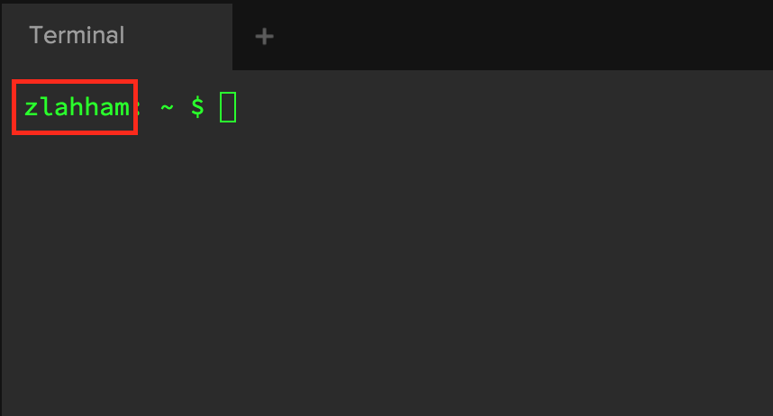

| [← Session 3](../session_3/README.md) |
|---------------------------------------|

## Ruby Course Session 4

Session Outline:
- Recap
- Upgrading our Ruby version
- Arrays
- Hashes
- Exercises

Recap of Session 3
------------------
In the previous session, we got introduces to different loops in the Ruby language. We started with `while` loops and demonstrated how they perform. We then moved onto `for`, `upto`, `downto`, and `times` loops. We saw how each of them work and how some of them can be used in lieu of others.


Upgrading our Ruby version
--------------------------
As you might remember from the first session, we installed Ruby 2.0.0 using Koding's built in package manager. That was fine for the first few sessions because we were learning about some core features of Ruby that have not changed much since that version. Today, the latest stable release of Ruby is 2.3.0, this is something that we can check out from the [Ruby-lang website](https://www.ruby-lang.org/en/downloads/).

In order to download different versions of Ruby, we will be using a version manager to that, called [RVM](https://rvm.io/). RVM allows us to easily install, manage, and work with multiple ruby environments from interpreters to sets of gems. Please feel free to read more about RVM on its website.

Please follow the below instructions carefully and don't make any spelling mistakes. Also, when you see the word `username` this means you have to replace it with your actual username which is first word that shows up when you fire up your terminal, before the `:`. For example, here is mine:


1. Open up a Terminal tab and type: `sudo chown -R username ~username/.gnupg`
2. Type `chmod 600 ~/.gnupg/gpg.conf`
3. Type `chmod 700 ~/.gnupg`
4. Go to https://rvm.io/rvm/install
5. Copy the entire command that begins with `gpg` into your terminal
6. Then type the following into your terminal: `\curl -sSL https://get.rvm.io | bash -s stable --ruby`

If you followed the above steps, you should now be able to use rvm as your version manager for different Ruby versions. The first thing we are going to do it to use the latest stable release and make it the default version.

- Type `rvm install 2.3.0` into your terminal and wait for it to install
- As soon as the download is complete, type `rvm list'. We are looking for that new version to be in our list.
- If you see the version, please type `rvm use 2.3.0 --default`, which will now make our default version of Ruby to 2.3.
- To confirm that this is the case, please type `ruby -v` and expect to see that new version


Arrays
------
Simply put, arrays are a type of data structure/variable that stores list of values. These values can be strings, integers, booleans, symbols, or even other sub-arrays.

The things that you store in an array, irrespective of their datatype, are called elements.
Here are a few sample array:

```ruby
array = [ 1, 5, 7, 12, 78 ] # => 5 elements

another_array = [ "Mike", 27, "USA", "Green" ] # => 4 elements

two_dimensional_array = [ [ "a", "b", "c" ], [ 1, 2, 3 ], [ "do", "re", "mi"] ]
# => 3 elements
```

The final example tells us that there are only 3 elements in the given array. This might be confusing at first, but the answer is quite simple. When you look at an array, you should only count how many elements are in the top level that we are concerned with. In this case, we are dealing with two levels, the first of which contains 3 elements, which happen to be arrays.
Arrays of arrays are called multidimentional arrays.

### Indexing
We have to understand that arrays in Ruby store information in a **sequence**. Because of this, everything stored in arrays will always be accessed in a chronological order.

One of the features that make arrays useful is the ability to call on the indeces of its elements. Each element in an array has an index that we can refer to. Indexing starts with 0 rather than 1. This is something that you have to understand from the beginning.
Looking at the following array, let's try to understand indexing.

```ruby
arr = [2, 5, 49, 1043, 7]
```

|index | element|
| ---- | ------ |
| 0    | 2      |
| 1    | 5      |
| 2    | 49     |
| 3    | 1043   |
| 4    | 7      |
How do we confirm this? We'll I would say let's print the values of the elements using their indices
```ruby
print arr[0] # => 2
print arr[1] # => 5
...
...
```

Notice that we used the square brackets to get back the element value/content. This is the case when dealing with indices, we always use the square brackets.

We also use the same brackets to assign values to certain element, this includes over-writing or creating a new element. Let's take a look at the following example:

```ruby
arr = [ 1, 1, 2016 ]

# Overwriting an existing element using its index
arr[0] = 22
puts arr # => [22, 1, 2016]

# Creating a new element using a non-existing index
arr[3] = 51
puts arr # => [22, 1, 2016, 51]
```


### Some Array methods
Arrays have many different methods that the respond to, we're going to explore a handful and please try to read about the rest on the Ruby Official documentation.

If you call `.methods.count` on a sample array you will get a number over 160. That's a massive list of methods!


#### length/ count
```ruby
arr = [1,2,3,4,5,6,7,8,9,10]
arr.length # => 10
arr.count # => 10
```

#### max & min
```ruby
arr = [123, 901, 1, -89]
arr.max # => 901
arr.min # => -89
```

#### reverse
```ruby
arr.reverse # => [10, 9, 8, 7, 6, 5, 4, 3, 2, 1]
```

#### each
The `each` method allows you to iterate through an array's elements and apply a block of code to the elements. Let's take a look at a few of the ways we can apply this method.

```ruby
arr.each do |i|
  print i
end
# => 12345678910

arr.each do |i|
  print i += 1
end
# => 3456789101113

```

This sort of looks like some of the loops we learned about. This is somewhat true in the sense that we are looping over a finite amount of elements in the array and in each iteration we printed the value of that element.

Keep in mind that `each` is dealing with the actual value of the element and not its index.

#### push
The `push` method pushes a value into an integer as a new element at the end. It takes the value to be pushed as an argument

```ruby
arr # => [1, 2, 3, 4, 5, 6, 7, 8, 9, 10]
arr.push(11)
arr # => [1, 2, 3, 4, 5, 6, 7, 8, 9, 10, 11]

```

#### pop
`pop` does the opposite of `push`. It simply pops out the last element and removes it from the array.

```ruby
arr # => [1, 2, 3, 4, 5, 6, 7, 8, 9, 10, 11]
arr.pop
arr # => [1, 2, 3, 4, 5, 6, 7, 8, 9, 10]
```
#### first/ last
arr.first # => 1
arr.last  # => 10

#### join
The `join` method is what we use to convert an array into a string, it also takes on an optional arguments that acts as a separator between the elements.

```ruby
full_name = ["Ice", "Cube"]

full_name.join #    => "IceCube"
full_name.join(' ') => "Ice Cube"
full_name.join('-') => "Ice-Cube
```

### Array.new
`Array.new` creates an instance of the Array class for us in the same way that `array = []` works.

We can also add an argument to the `new` method that will create a number of elements for us depending on the number passed in.

```ruby
arr = Array.new    # => []
arr = Array.new(5) # => [nil, nil, nil, nil, nil]
```

If we want the elements to contain some other default object other than `nil`, we would have to pass in another argument after the `5` in the previous example.

```ruby
arr = Array.new(5, 0) # => [0, 0, 0, 0, 0]
```


Exercises
---------

### Exercise 1
The following string should ideally be an array.
```ruby
animals = "Cow Cat Dog Elephant Horse Jaguar Zebra"
```

Find out how to convert this to an array.

### Exercise 2
Remember the `<<` we used last time? Try to find one of the methods that we've come across today and think about how it relates to that.

Use that method to put a new entry into the animals array from the previous exercise. For example, ask for the users favourite animal and then throw that into the animals array.

### Exercise 3
Create two-dimensional array that containts 3 sub-arrays using the `Array.new` way.

```ruby
# Your code here 👇 👇 👇
...
...
arr = [ [1, 1, 1], [1, 1, 1], [1, 1, 1] ]
```

<!-- Array.new(3) { Array.new(3) } -->

### Exercise 4
Create a program that will take in a students grades and it will then return the average as a rounded down integer. For example, 99.123 becomes 99.

```ruby
grades = [ 59, 70, 63, 65, 74, 55, 52, 67 ]
# Your code here 👊 👊 👊 👊
average_result = 63
```

<!--
  total = 0
  grades.each { |grade| total += grade }
  total/grades.length
 -->

### Exercise 5
Read up on the `select` method. Use this method to look through the following array and return the number of animals.

```ruby
array = [ false, 892, "animal", 22,
          "fruit", "animal", "animal",
          "animal", "veggie", "animal",
          true, 74, "bread", "pasta",
          "animal", "human", "animal", true ]
```

<!-- array.select {|elem| elem == "animal" }.length -->

### Exercise 6
Repeat Exercise 6 but this time using a method that begins with the letter `c`. Find this method by digging into the ruby docs.


<!-- array.count("animal") -->

### Exercise 7
You are given an array with numbers of different patterns, such as: `[2, 4, 6, 8, 10]` or `[1, 3, 9, 27]`. You are also given a divisor.

Write a program that will return all numbers from our array which are divisible by the given divisor. Using the following inputs, your program should be able to solve for both cases below:

```ruby
# Case 1
numbers = [0,1,2,3,4,5,6]
divisor = 4

# Case 2
numbers = [1,2,3,4,5,6]
divisor = 2
```

<!--
```ruby
  array = []
  numbers.each do |number|
    if number%divisor == 0 
      array << number 
    end
  end
  array

  OR

  numbers.select do |n|
    n % divisor == 0
  end
```
-->
