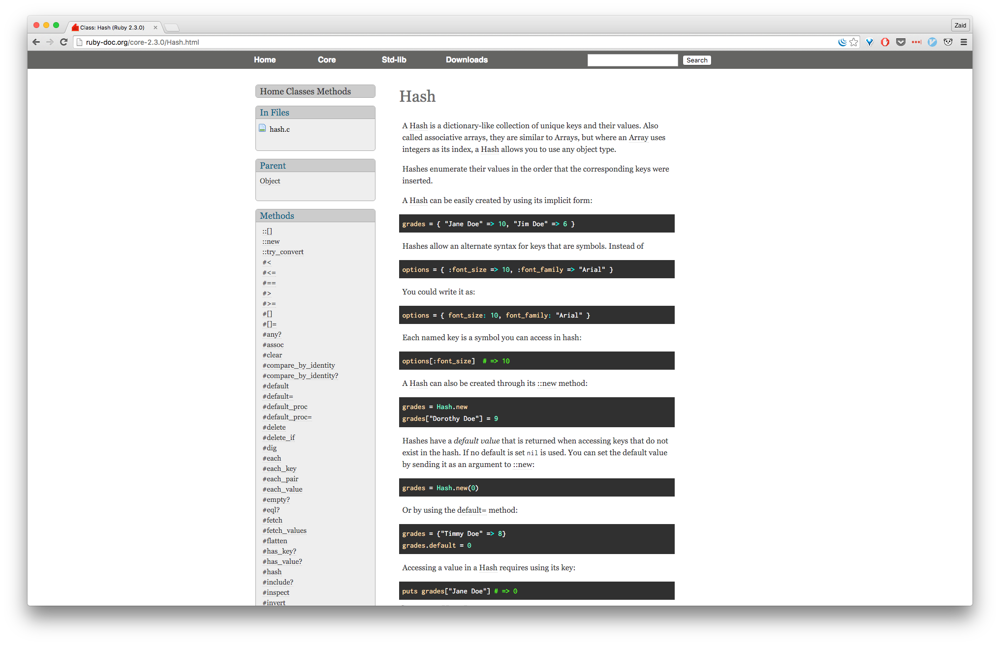
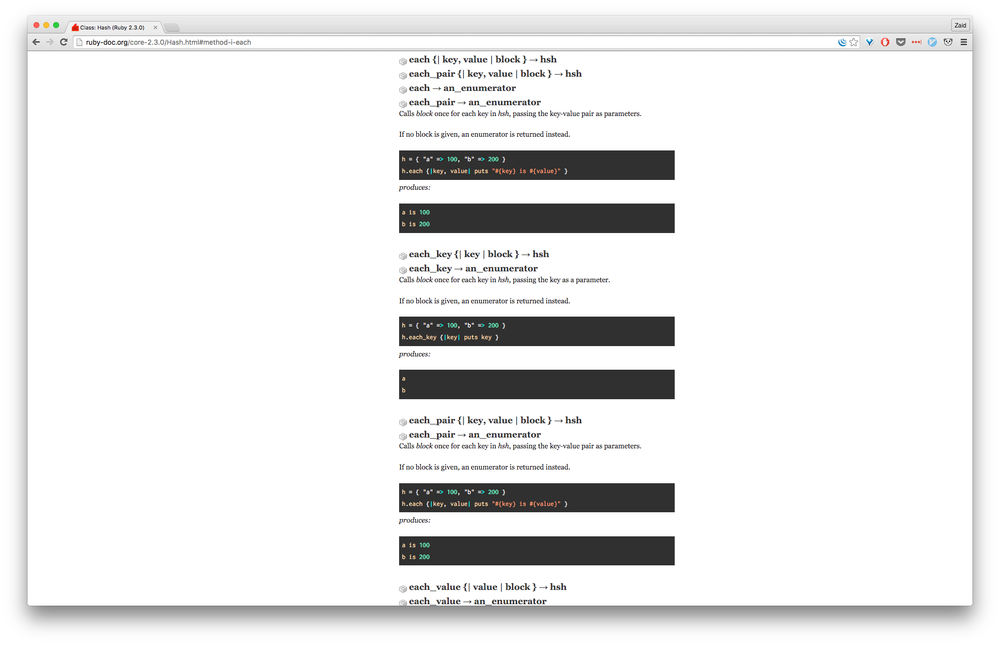

| [← Session 4](../session_4/README.md) |
|---------------------------------------|

## Ruby Course Session 5

Session Outline:
- Recap
- Hashes
- Exercises

Recap of Session 4
------------------
In the previous session, we were introduced to Arrays Ruby language. With arrays we were able to start making use of data structures in the scope of accessing and modifying elements in a list.

Hashes
------
Hashes are the older cousin to arrays. The have more functionality but still share some features with arrays. Unlike arrays, hashes don't have to use integer indices like arrays; they can use any data type to do so. Don't worry if this might sound a bit confusing, we'll clear this up later.

Before explaining hashes any further, lets take a quick look at the code difference between a hash and an array, both of which contain person information for a given user.

```ruby
# Array implementation
info = ['Mike', 'Ike', 29, 'Blue']

# Hash implementation
info = {
  'First name' => 'Mike',
  'Last name' => 'Ike',
  'Age' => 29,
  'Eye colour' => 'Blue'
}
```

Just a quick glance at both structures tells a lot about hashes. First of all, data is stored in `{}` rather than `[]`. Secondly, we have a better way to call on the actual elements with the introduction of the key and value pairs. A key is what helps us in accessing the actual value, so for example, we can directly ask the info hash to return the age of our user without having to know its index, and we can do it like so:

```ruby
puts info['Age']
# => 30
```

The above example also reminds us of how to access an element in an array. It is practically the same syntax.

Another point that can be noticed is the hash rocket `=>`, this points a given key to its value. This is the old way of expressing keys and values, but it is still used widely.

So how do we go about creating a Hash without using the **literal notation** like we did in the above examples?
Well this is where it also reminds of creating an Array. We would use the method `new` and call it on the Hash class like so:

```ruby
info = Hash.new

puts info
# => {}
```

#### Iterating over Hashes
This is another area that we learned when we dealt with arrays. This will be slightly different with hashes.
As a reminder, when we "Iterate" through an array/hash, we are basically looping through them for a finite number of iterations.

`.each` was a big one from arrays. We will use it again here for hashes quite a lot.
Let's just first take a look at the syntax of `each` when used for a hash and then we will go into further details about the optional parameters and so on.

```ruby
# Taking the info hash from the above examples:

info.each do |key, value|
  puts "your #{key} is: #{value}"
end

=begin
your First name is: Mike
your Last name is: Ike
your Age is: 29
your Eye colour is: Blue
=end
```

This looks way easier that having to specify what every element in an array contains. We are simply telling the hash to return each key and its value, andif you take a close look after we called the `.each` method, you can see that we now have two parameters because of the key-value pair in hashes.

*Side note*: if you feel that this is confusing you, don't worry, everyone gets confused when you start dealing with more parameters and optional arguments. Let's go the official [Ruby docs](http://ruby-doc.org/) in order for us to see how to make sense of all this.

If we look under the 2.3.0 Core, and then look for the Hash Class documentation, we will get to a page that looks like this:



On the side bar, we can look for the `each` method and from there well see this:



Try reading through the documentation for this method and let's discuss this when you're done.

#### The`each_key` and `each_value`
These methods allow you to call a certain block of code for each key and each value respectively. This is valuable if we only want to use one of the pair rather than use both at the same time.

This also means that we will have only one argument in these new methods.

```ruby
hash = { "a" => 1, "b" => 2 }

hash.each_key { |key| print key }
# => a b

hash.each_value { |value| print value }
# => 1 2
```

Hashes and `nil`
----------------
So far we haven't really touched `nil`. We just know that `nil` is a non-true value, just like `false`. In Ruby, `nil` is considered to be "Falsey" rather than just plain old false.

`nil` means that there is nothing at all in here, while `false` means this is not `true`. There is a massive difference between the two and each of them have their rightful place in the language.

When we bring hashes into the mix, we can start to get a basic understanding of how `nil` operates. Let's take a look at the following example which will attempt to highlight what happens when we call on a key that doesn't exist in our hash.

```ruby
food_in_fridge = {
  'pizza' => 1,
  'eggs'  => 4,
  'milk'  => 1,
  'ham'   => 3
}

food_in_fridge['pizza'] # => 1
food_in_fridge['pasta'] # => nil

```

As you can see, when we asked the hash if it has any keys that are called `pasta`, we got a `nil` object.

What if we wanted to get something else in return, other than `nil`? A good case usage would be maybe auto correct ourselves when debugging for mistakes. This would have to take place before we create the Hash, we would pass an argument that would be returned instead of `nil`.

```ruby
food_fridge = Hash.new("NO NILS HERE!")
```

Hashes and Symbols
------------------
We've seen examples where we use different Ruby data types to act as our keys in hashes. This is perfectly fine to do. However, the Ruby community usually agrees that symbols are the best data type for keys. This would still work in the same way, but other than using strings, we will use symbols.

Just as a reminder, symbols are the cousins to strings, with a few slight differences:
- They persist in memory as the same object when called upon multiple times
- They begin with a colon and don't end with anything else

Example of a symbol vs string:

```ruby
profession = "Ninja"
profession = :ninja
```

In terms of using symbols inside a hash, this is how we would do so:

```ruby
food_in_fridge = {
  :pizza => 1,
  :eggs  => 4,
  :milk  => 1,
  :ham   => 3
}
```

In addition, we have to take care when dealing with symbols because we can't use spaces between words like we used to in strings, so `'First name` would now become: `:first_name`.

As a general rule, try to use symbols in lieu of strings when dealing with keys inside hashes. The reasoning behind this is based on the following facts:
- Symbols cannot be changes once created
- Symbols save memory
- Symbols are faster to manipulate in hashes than strings.

#### To hash rocket or not to?
So far we have used hash rockets `=>` to link keys with values inside our hashes. This is perfectly okay and arguably more expressive than the new way of linking them. However, in Ruby 1.9 the new way was introduced and we don't know if support for the hash rocket will be dropped, so to be on the safe side, we'll learn it.

You also have to bear in mind that this applies only to symbols!

```ruby
# Hash rocket

hash = {
  :name => 'Chris'
}

# No hash rocket

hash = {
  name: 'Chris'
}
```

Clean and simple, right?

This entails the follows:
- get rid of the colon in front of the symbol
- place a colon after the word
- remove the hash rocket all together


Summary
-------
- Hashes are a collection of key-value pairs
- Keys must be unique
- Two ways to create hashes
- Old vs new syntax

Exercises
---------

### Exercise 1
We are trying to push a hash object that is given to us into an Array. The following code is not doing the job, please try to fix it.
Try to remember how to push elements into an array.

```ruby
arr = []
arr.push {:a => "b", :c => "d"}
```

<!-- SOLUTION:

```ruby
arr = []
arr << {:a => "b", :c => "d"}
# OR
arr.push({:a => "b", :c => "d"})
```
-->

### Exercise 2
I have this really annoying and long hash that I would like to get rid of, but the only problem is that I can't delete its content without using an approved Hash method to remove all its keys and values. Please help me by finding a method to do this.

```ruby
h = {'dog' => 'canine', 'cat' => 'feline', 'donkey' => 'asinine', 12 => 'dodecine' :three => 'number', 'name' => 'Carlos'}

# End Result:
h = {}
```

### Exercise 3
Because you removed everything in my hash, you will now have to assist me in populating it again, please? 😇
I want the new hash to contain the following:
- All key should be strings that point to values
- All values should be Arrays

Here are the arrays that I need:

```ruby
[ 90, 55, 73, 79, 65, 42, 78, 19, 77 ]
[ 'fred', 'charlie', 'samantha', 'bash', 'bryan', 'pedro', 'kang', 'morty', 'tan' ]
[ 22, 21, 20, 20, 19, 22, 29, 22, 21 ]
```

I'll leave it upto you to name the keys that point to the above values. All I need is a clean way to organise this data so I can manipulate it later (you will probably also do that, not me 😜).

<!-- SOLUTION:

```ruby
student_data = {
  'grades' => [ 90, 55, 73, 79, 65, 42, 78, 19, 77 ],
  'names'  => [ 'fred', 'charlie', 'samantha', 'bash', 'bryan', 'pedro', 'kang', 'morty', 'tan' ],
  'ages'   => [ 22, 21, 20, 20, 19, 22, 29, 22, 21 ]
}
```
-->

### Exercise 4
Using your newly created hash from Exercise 3, now I want you to help me find the highest grade in my class and return its the name of that student, their grade, and the age.

*HINT*: Iterate through the hash after getting the vital information from the array 🤔
This is simpler that you might think at first.

<!--
SOLUTION:

```ruby
student_data = {
  'grades' => [ 90, 55, 73, 79, 65, 42, 78, 19, 77 ],
  'names'  => [ 'fred', 'charlie', 'samantha', 'bash', 'bryan', 'pedro', 'kang', 'morty', 'tan' ],
  'ages'   => [ 22, 21, 20, 20, 19, 22, 29, 22, 21 ]
}

highest_grade = student_data['grades'].max
highest_grade_index = student_data['grades'].index(highest_grade)

student_data.each do |key, value|
  puts value[highest_grade_index]
end
```
-->

### Exercise 5
Convert the following hash's keys from strings to symbols using `replace`.

```ruby
hash = {
  'name'  => 'Jay',
  'age'   => 53,
  'likes' => 'food'
}
```

<!-- SOLUTION:

```ruby
hash.replace({:name => "jay", :age => 53, :likes => "food"})
```
-->

### Exercise 6
A food critic would like us to provide him with the best dishes on the menu according to their rating. Take the following hash and add the necessary code to display the dishes that have a rating that is higher that 7.

Oh, also find the bugs in the hash before you start and fix them. Remember, we want to use the new Ruby syntax for this hash.

```ruby

dishes = {
  bolognese:            7,
  :pizza: =>            8,
  'oysters':            10,
  burgers:              8,
  'sea food platter' => 3,
  nachos:               9
}

```


<!-- SOLUTION:

```ruby
dishes = {
  bolognese: 7,
  pizza: 8,
  oysters: 10,
  burgers: 5,
  sea_food_platter: 3,
  nachos: 9
}

dishes.select { |dish, rating| rating > 7 }
```
-->

